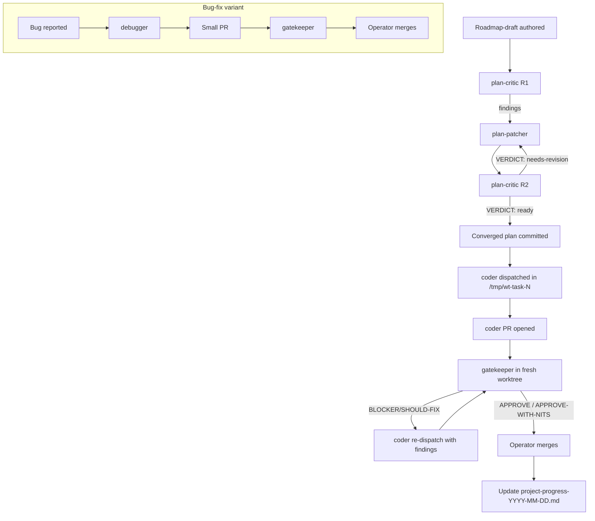

# Autonomous-pipeline conventions

**Version:** 1 (2026-05-15). Bump and date the version line on every substantive change.

## 1. Purpose

This file is the externalized contract for the autonomous-agent pipeline that this
project actually uses. It exists so that the pipeline itself is a versioned project
artifact rather than tacit operator knowledge.

Concretely, this document mitigates three failure modes:

1. **Pipeline bus-factor.** If today's operator vanishes, a fresh session must be
   able to read this file + `CLAUDE.md` + the latest `docs/project-progress-*.md`
   and reconstruct the workflow without guessing.
2. **Silent drift.** Subagent roles, gatekeeper criteria, and recovery playbooks
   tend to live in chat history. When they move out of chat and into a versioned
   file, regressions become reviewable.
3. **Reproducible restart.** A new session should be able to confirm — by checklist
   — that environment, in-flight PRs, and console state match expectations before
   touching anything.

This doc does not duplicate the architecture spec (`docs/architecture-v0.1.md` is
FROZEN) and does not duplicate the operator runbook
(`docs/manual-test-handbook.md`). It documents *how work moves through the pipeline*
between those two anchors.

---

## 2. Subagent roles

Each role below names a `subagent_type`, what it is for, what it is **not** for, the
shape of a typical dispatch prompt, and the expected return.

### 2.1 `coder`

- **When to use.** Implement a focused, single-PR change against a converged plan
  (per `CLAUDE.md` coding rule 4: one PR, one outcome).
- **When NOT to use.** Open-ended investigation; cross-cutting refactors; spec
  edits. A coder dispatched without a converged plan will overshoot.
- **Prompt shape.** Cite the plan file or the ROADMAP task by number. Pin the
  worktree path (`/tmp/wt-<name>`), the canonical venv
  (`/raid/yid042/venvs/companion-harness/bin/python`), and the success criterion
  (typically: a named `pytest -k <selector>` turns from skipped/failing to green).
  Include the regression-grep watch-list (§5) explicitly.
- **Expected return.** Branch name, commit SHA, list of files changed, the exact
  pytest invocation + result, regression-grep output, and a one-line PR title.

### 2.2 `debugger`

- **When to use.** A bug exists, is reproducible (or is a contract-test failure on
  main), and the fix is expected to be small and surgical. Pair with
  `/fix-bug-while-manually-testing` when the bug surfaced during a manual session.
- **When NOT to use.** Greenfield features; design questions; "improve" requests.
  Debuggers chase a hypothesis to a root cause; they are not feature implementers.
- **Prompt shape.** Repro steps (or a failing test invocation), the observed
  symptom, the suspected component, and the constraint "smallest fix that closes
  the symptom, no opportunistic refactors" (`CLAUDE.md` coding rule 3).
- **Expected return.** Root-cause narrative, the surgical diff, the test that now
  passes, and a regression test added to the suite.

### 2.3 `gatekeeper` (spec-gatekeeper)

- **When to use.** Every PR. Coder finishes → gatekeeper reviews in a *fresh*
  worktree against `origin/main` (not the coder's worktree). The loop converges
  when the latest ledger entry reads `Verdict: APPROVE` or `APPROVE-WITH-NITS`
  (see `meta/pr-review-ledger.md`, established pattern PR #1 round 2).
- **When NOT to use.** Doc-only PRs that touch zero code files — note them in the
  ledger but skip the invariant checks.
- **Prompt shape.** PR number, the ROADMAP task / plan section the PR targets,
  the watch-list to enforce, and the canonical-venv path for any pytest reruns.
- **Expected return.** A ledger entry appended to `meta/pr-review-ledger.md`
  containing: `Verdict`, `Findings` (each tagged `[BLOCKER]`/`[SHOULD-FIX]`/`[NIT]`
  with file:line citations), `Scope check`, `Invariant checks` (one PASS/FAIL line
  per relevant invariant from `CLAUDE.md` §Core invariants), and any
  `Cross-PR watch-items created` / `checked`.

### 2.4 `plan-critic`

- **When to use.** A roadmap-draft or plan file exists but has not yet converged.
  Adversarial review surfaces BLOCKERs, CONCERNs, and NITs before any code is
  written. Reference: `docs/roadmap-v0.1e-draft.md` ran four critic passes; the
  diminishing-returns inflection (4 → 3 → 2 → 1 BLOCKERs) is the convergence
  signal.
- **When NOT to use.** Implementation-level review of a written PR — that is
  gatekeeper's job. Plan-critic operates on plans, not diffs.
- **Prompt shape.** Path to the plan file, the round number, the spec sections
  the plan must comply with, and a directive to label every finding
  `BLOCKER`/`CONCERN`/`NIT` with the affected plan-section number.
- **Expected return.** Numbered findings list, an explicit `VERDICT:
  ready|needs-revision`, and a recommendation on whether another round is
  warranted.

### 2.5 `plan-patcher`

- **When to use.** Between plan-critic rounds. The patcher applies the numbered
  findings from the previous round verbatim, without re-litigating them, and
  re-emits the plan file.
- **When NOT to use.** When critic verdict is already `ready` — patching at that
  point introduces drift.
- **Prompt shape.** Path to plan file, path to critic findings (or the inline
  finding list), and a directive to apply *all* findings or to enumerate why a
  finding is being deferred.
- **Expected return.** Updated plan file, a per-finding application log, and any
  deferred findings marked for the next round.

### 2.6 `researcher`

- **When to use.** Read-only investigation that requires reading many files and
  synthesizing a written answer. Spec-researcher passes for ambiguous spec lines
  (see `docs/roadmap-v0.1e-draft.md` Open Questions OQ-8) are the canonical case.
- **When NOT to use.** Anything that needs to write code or touch git. Researchers
  produce prose, not commits.
- **Prompt shape.** The question, the corpus to search (typically `docs/`,
  `companion_harness/`, `tests/`), and the format of the expected answer
  (numbered findings, an Open Questions list, a one-page brief).
- **Expected return.** A text report with cited file paths and line numbers, no
  speculation past what the corpus supports.

### 2.7 `Explore`

- **When to use.** Read-only code search where the question is "where does X
  live" or "what calls Y". Faster than a researcher when the question is purely
  topological.
- **When NOT to use.** Anything requiring synthesis or judgement — escalate to
  `researcher`.
- **Prompt shape.** Search terms, optional file globs, and the form of the
  desired answer (list of file:line hits, or a small structural diagram).
- **Expected return.** A list of file paths with line citations.

---

## 3. Convergence pipeline

The canonical flow from "we should build X" to "X is merged on main."



### 3.1 Plan convergence

- Drafts live as `docs/roadmap-v0.1<letter>-draft.md` or `docs/plan-<topic>.md`.
- A plan-critic + plan-patcher loop runs until critic returns
  `VERDICT: ready`. Two rounds is typical; four was the cap on v0.1e per
  `docs/roadmap-v0.1e-draft.md`. More than four rounds is a signal that the
  plan should be split.
- The converged plan is committed to `docs/` before any coder is dispatched.
  Code without a converged, committed plan invites scope creep.

### 3.2 Implementation

- One coder per worktree. Worktree path is `/tmp/wt-<short-task-name>`. Coders
  never edit the main working tree (§4).
- The coder's PR title cites the ROADMAP task or plan section: e.g.
  `v0.1j Task 9: addressing producer routing (...) (#182)`. See merged PRs
  90b6b39, de03cbb for the established title shape.
- The coder runs the regression-grep (§5) and the canonical-venv pytest before
  pushing.

### 3.3 Gatekeeper

- Gatekeeper checks out the PR in a *fresh* worktree from `origin/main` plus the
  PR branch. Running against the coder's worktree masks dirty-state contamination.
- Every gatekeeper pass writes a ledger entry. Even a clean APPROVE gets an
  entry — the ledger is the audit trail. See `meta/pr-review-ledger.md` PR #1 +
  PR #1 round 2 for the canonical format.
- Re-review rounds use header `## PR #N — re-review round M`. They reference the
  prior round's findings by tag and report `RESOLVED` / `STILL OUTSTANDING`.
- Operator merges only after seeing a clean APPROVE. Reviewers do not merge
  (`docs/remote-dev.md` §Gatekeeper-loop convergence).

### 3.4 Bug-fix variant

- Debugger investigates → small surgical PR → gatekeeper → merge. The plan-critic
  layer is skipped; the bug report itself is the spec.
- The fix PR title prefix is `fix:` and references the closing issue or the
  Finding number (e.g. PR #260 `fix: orchestrator dedupes policy_decision at
  turn boundaries (closes Finding 9)`).

### 3.5 Auto-merge

- Default: operator merges. Auto-merge is **off** unless the operator authorizes
  it in the dispatch prompt for a specific PR.
- Auto-merge to `main` requires APPROVE (not APPROVE-WITH-NITS) and a green CI.

---

## 4. Worktree discipline

The rule, stated minimally:

> Never edit the main working tree
> (`/home/yid042/projects/companion-agent-harness`). Every task starts with
> `git worktree add /tmp/wt-<name> origin/main` (or `origin/<base-branch>`),
> then `git checkout -b <feature-branch> origin/<base>` inside that worktree.

### Why it exists

- **Stale-base contamination.** A coder branching off a local main that hasn't
  pulled in days will silently revert merged work. Fresh-clone-from-origin is
  the only reliable defense.
- **Concurrent sessions.** Multiple agents (or multiple operator sessions) can
  run in parallel without stepping on each other when each owns a `/tmp/wt-*`
  worktree. The main working tree stays reserved for the operator's interactive
  context.
- **Reviewer hygiene.** Gatekeeper runs in *another* fresh worktree, so the
  review environment matches what a third party would see on `gh pr checkout`.

### Recovery: agent edited main worktree by mistake

1. From the main worktree: `git status` to inventory the dirty files.
2. If nothing has been committed: `git stash -u` (preserve, do not destroy).
3. Create the proper worktree: `git worktree add /tmp/wt-recover origin/main`.
4. In `/tmp/wt-recover`: `git checkout -b <intended-branch> origin/main`, then
   replay the stashed diff (`git stash show -p | git apply`).
5. In the main worktree: `git stash drop` *only after* confirming the replay
   succeeded.
6. Note the slip in the ledger entry so the pattern is visible.

Never use `git checkout -- .` or `git reset --hard` in the main worktree to
"clean up" — the operator may have uncommitted local context there.

---

## 5. Regression-grep + watch list

Before every push (coder) and on every review (gatekeeper), run a regression-grep
against the diff vs `origin/main`. The grep flags any deletion line
(`^-[^-]...`) that contains a token from the watch list.

### The watch list

Each token represents a load-bearing symbol from a merged PR. A line that deletes
one of these tokens is a candidate silent revert and must be defended in writing
before the PR proceeds.

Maintained list (v1 of this doc — keep in sync with `CLAUDE.md` pre-flight when
that section is updated):

1. `POLICY_VERSION` — versioned policy enum; never downgrade.
2. `primary_reason_code` — every `SpeakDecision` carries one.
3. `caused_by` — DAG closure; orphan events fail Stage 0.
4. `SensitiveField` — free-text fields are wrapped, never raw.
5. `log_drop_or_degrade` — backpressure event (invariant #10).
6. `late_subscribe` — `EventLogger` off-stream subscriber API (PR #241).
7. `assert_bit_identical` — Tier-B replay gate (`replay.py`).
8. `CommitResult` — memory commit enum (PR #240 fix).
9. `RUBRIC_VIOLATION` — aesthetic-rubric gate ReasonCode.
10. `ATTACHMENT_RISK_DAMPEN` — attachment-risk gate ReasonCode.
11. `UNAVAILABLE: #` — stub marker prefix; orphans break
    `test_unavailable_markers_have_issues.py`.
12. `signal_producer_fallback` — producer-routing telemetry event (v0.1j Tasks 8/9).
13. `_decision_in_flight` — orchestrator dedupe flag (PR #260 fix).

### How to extend the list

When a PR merges a new load-bearing symbol — typically a public API, an enum
member, or an event-type string that subsequent code relies on — add the token
in the same PR (or the next gatekeeper pass) and bump this doc's version line.
The criterion is "if this token disappeared from the diff silently, would
anything regress?" If yes, add it. If no, leave it out — the list pays for
itself only when every token is genuinely load-bearing.

### The grep invocation

```bash
git diff origin/main -- '*.py' '*.md' '*.yaml' '*.yml' \
  | grep -E '^-[^-].*(POLICY_VERSION|primary_reason_code|caused_by|SensitiveField|log_drop_or_degrade|late_subscribe|assert_bit_identical|CommitResult|RUBRIC_VIOLATION|ATTACHMENT_RISK_DAMPEN|UNAVAILABLE: #|signal_producer_fallback|_decision_in_flight)' \
  || echo "regression-grep clean"
```

Empty output (or the explicit `clean` line) is the success signal.

---

## 6. Common failure modes + recovery

Concrete patterns observed in this project. Each one has a recovery, not a
generic platitude.

### 6.1 Stale-base contamination

- **Symptom.** Coder's branch reverts code that exists on `origin/main`.
- **Cause.** Worktree was branched off a stale local main.
- **Recovery.** Rebase the feature branch onto `origin/main`:
  `git fetch origin && git rebase origin/main`. Re-run regression-grep. If the
  rebase reintroduces conflicts that look like the merged work, the merged work
  wins — drop the conflicting deletions.

### 6.2 Silent merged-PR revert

- **Symptom.** A feature that was merged last week is gone after a new PR
  merges.
- **Cause.** Regression-grep was not run, or the watch list was incomplete.
- **Recovery.** Identify the missing symbol, cherry-pick the original merge
  commit onto a recovery branch, ship as an atomic-rebuild PR. Update the watch
  list to cover the symbol. Note the slip in the ledger so the gatekeeper pass
  on the recovery PR is extra-thorough.

### 6.3 Invented issue numbers

- **Symptom.** A `# UNAVAILABLE: #N` marker cites issue `#N` that does not
  exist. `test_unavailable_markers_have_issues.py` fails.
- **Cause.** Agent guessed an issue number instead of looking it up.
- **Recovery.** Before any new marker ships, run
  `gh issue view <N> --repo Eden-kk/companion-agent-harness` to confirm `N` is
  real and open. If not, open the issue first, then add the marker.

### 6.4 Ghost pytest contention

- **Symptom.** Pytest hangs or fails with import errors that suggest another
  process is holding cached `.pyc` files in a foreign worktree.
- **Cause.** A previous agent's pytest run survived its agent's exit (e.g.,
  killed by harness timeout, leaving children).
- **Recovery.** `pkill -f 'pytest.*wt-'` to clear leftovers from finished
  agents' worktrees. Re-run in the current worktree. If contention persists,
  `ps aux | grep pytest` and SIGTERM specific PIDs by their `--basetemp` path.

### 6.5 Force-push authorization scope

- **Default.** Force-push is **never** authorized to `main` (operator confirms
  per push if ever needed).
- **Feature branches.** Force-push to a feature branch is acceptable when the
  branch is solo-owned by an agent and a rebase is required. Confirm no
  reviewer has pulled the branch first (`gh pr view <N> --json reviews`).
- **Recovery if main was force-pushed.** Stop everything. `git reflog` on a
  fresh clone to recover the prior `main` SHA. Push that back as a recovery
  commit. The force-push itself is a process violation worth a ledger note.

### 6.6 Catastrophic PR mislabel

- **Symptom.** PR title or body misstates scope (e.g. "docs:" on a code change,
  or wrong ROADMAP task number).
- **Recovery.** `gh pr edit <N> --title "..." --body "$(cat <<'EOF' ... EOF
  )"`. If the PR is already merged, open a follow-up `docs:` PR that corrects
  the historical record in `project-progress-*.md`. If the PR is far enough off
  that the diff itself does not match the title, close it
  (`gh pr close <N> --comment "scope drift; redispatching"`) and redispatch the
  coder with a corrected prompt.

### 6.7 Subagent stuck mid-run

- **Symptom.** A dispatched subagent is past its expected runtime with no
  output.
- **Recovery.** Use the `TaskStop` tool to cancel cleanly. Inspect the
  worktree to see how far the agent got. Redispatch with a tighter prompt or a
  smaller scope. If the agent committed but did not push, decide per-commit
  whether to keep or discard — never auto-discard committed work.

---

## 7. Release-gate criteria

A milestone PR (any PR that bumps `POLICY_VERSION`, ships a new milestone, or
merges a feature explicitly named in the roadmap) must pass every item below
before merge. Doc-only and small-fix PRs only need the items that touch their
changed surface.

1. **`POLICY_VERSION` migration safety.** If `POLICY_VERSION` was bumped, every
   fixture that pins a version was updated in the same PR. Search:
   `grep -rn "POLICY_VERSION\s*=" tests/ companion_harness/evals/scenarios/`
   and confirm all hits are aligned.
2. **`test_policy_replay_exact` passes for the new version.** Bit-identical
   replay is invariant #5. Failures here are not "flaky tests" — they are
   determinism regressions.
3. **`test_unavailable_markers_have_issues` passes.** No orphan
   `# UNAVAILABLE: #N` markers; every cited issue is in
   `KNOWN_UNAVAILABLE_ISSUES`.
4. **`test_runtime_does_not_import_evals` passes.** Import direction is
   one-way (evals → runtime, never the reverse). AST-level check; commented-out
   imports do not false-positive.
5. **Regression-grep clean** against the 13-token watch list (§5).
6. **Gatekeeper APPROVE** on the PR — final ledger entry reads `Verdict:
   APPROVE` or `APPROVE-WITH-NITS` with all SHOULD-FIX items resolved.
7. **Operator merges.** Auto-merge is off unless explicitly authorized for the
   specific PR.

Canonical invocation, run inside the PR's worktree on the canonical venv:

```bash
/raid/yid042/venvs/companion-harness/bin/python -m pytest \
    tests/test_policy_replay_exact.py \
    tests/test_unavailable_markers_have_issues.py \
    tests/test_runtime_does_not_import_evals.py \
    -v
```

---

## 8. Reproducibility checklist

Fresh session, cold start, no chat history. Run this checklist before doing
anything else.

1. **Read the orienting trio.**
   - This file (`docs/autonomous-pipeline-conventions.md`).
   - `CLAUDE.md` at the repo root (invariants + coding discipline).
   - The latest `docs/project-progress-YYYY-MM-DD.md` (current state, in-flight
     PRs, stub catalog).
   - If a milestone is active, the relevant `docs/roadmap-v0.1<letter>-draft.md`
     and/or `docs/plan-<topic>.md`.
2. **Check in-flight work.**
   - `gh pr list --state open --repo Eden-kk/companion-agent-harness` — every
     in-flight PR.
   - `gh issue list --state open --repo Eden-kk/companion-agent-harness
     --label in-flight` (if the label is in use) — open issues with assigned
     work.
3. **Confirm the canonical venv.**
   - `/raid/yid042/venvs/companion-harness/bin/python -c "import websockets,
     aiohttp, faster_whisper, onnxruntime"` — must exit 0.
   - If this fails, see `docs/remote-dev.md` §Environment before doing anything
     else. Do not fall back to bare `python3`.
4. **Confirm console state** (only if the operator is about to manual-test).
   - `curl -s http://localhost:8800/healthz` — must return 200 with
     `"live_pipeline_ready": true`.
   - If down: start per `docs/project-progress-2026-05-15.md` §"What the
     operator can do right now", and wait 60–120 s for the
     `live pipeline ready` log line.
5. **Confirm no orphan pytest processes.**
   - `ps aux | grep -E 'pytest.*wt-' | grep -v grep` — should be empty. If not,
     §6.4.
6. **Confirm worktree cleanliness.**
   - In the main working tree: `git status` — uncommitted operator work, if
     any, is preserved; do not touch it.
   - List existing worktrees: `git worktree list`. Each `/tmp/wt-*` corresponds
     to an in-flight task. Stale worktrees from completed PRs:
     `git worktree remove /tmp/wt-<name>` once the corresponding PR is merged.
7. **Confirm `origin/main` is current.**
   - `git fetch origin && git log --oneline -5 origin/main` — sanity-check
     against the most recent merged PR titles you'd expect to see.

If all seven items pass, the pipeline is healthy and ready for the next
dispatch.

---

## Appendix: pointers

- Architecture spec (FROZEN): `docs/architecture-v0.1.md`.
- Coding discipline + invariants: `CLAUDE.md`.
- Operator runbook: `docs/manual-test-handbook.md`.
- Current-state snapshot: `docs/project-progress-2026-05-15.md` (replace date
  with most recent).
- Remote workflow: `docs/remote-dev.md`.
- Eval CLI: `docs/eval-quickstart.md`.
- Gatekeeper ledger: `meta/pr-review-ledger.md`.
- Adapter inventory + stub catalog: `docs/model-stack.md`.
